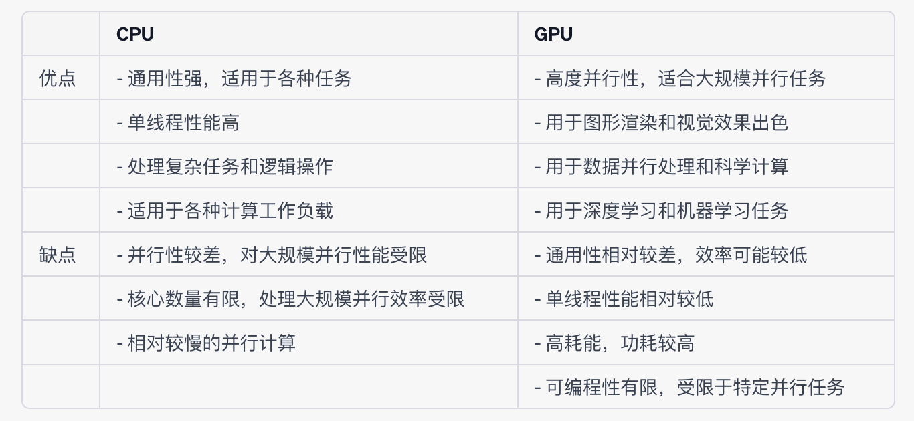

# baseline
# 赛题背景
基于提供的样本构建模型，预测用户的新增情况。赛题数据由约62万条训练集、20万条测试集数据组成，共包含13个字段。其中uuid为样本唯一标识，eid为访问行为ID，udmap为行为属性，其中的key1到key9表示不同的行为属性，如项目名、项目id等相关字段，common_ts为应用访问记录发生时间（毫秒时间戳），其余字段x1至x8为用户相关的属性，为匿名处理字段。target字段为预测目标，即是否为新增用户。<mark>竞赛的评价标准采用f1_score，分数越高，效果越好</mark>
# Q
1:为什么选择机器学习算法？为什么不考虑深度学习？
A:如果特征工程能够充分捕捉数据的关键特征，那么机器学习算法也能够表现很好。深度学习在某种程度上可以自动学习特征，但对于特定问题，手动设计手动设计特征可能会更有效。
2:CPU和GPU的区别是什么？
A：
3:为什么要对 'udmap' 列进行 One-Hot 编码？原因？
A:将 'udmap' 列进行 One-Hot 编码的原因是为了将该列中的离散值（categorical values）转换为计算机可以处理的数值形式
* 解决分类变量问题： 'udmap' 列中的每个值都代表不同的行为属性，属于分类变量。机器学习算法通常需要输入数值数据，因此需要将这些分类变量转换为数值形式。One-Hot 编码可以将每个不同的分类值映射为一个独立的二进制特征列。
* 防止数值误解： 如果不进行编码，算法可能会错误地将 'udmap' 列的值解释为数值变量，这可能导致错误的数学操作和预测结果。
* 避免有序性假设： 如果 'udmap' 列中的值之间存在某种顺序或有序关系，但实际上这只是分类属性，One-Hot 编码可以避免算法错误地假设其有序性。
* 提供更好的表示： One-Hot 编码将每个分类值都表示为独立的二进制特征列，使算法可以更好地理解和区分不同的行为属性
# import 库
```
import pandas as pd # 导入 pandas 库，用于数据处理和分析
import numpy as np # 导入 numpy 库，用于科学计算和多维数组操作
from sklearn.tree import DecisionTreeClassifier # 从sklearn.tree模块中导入DecisionTreeClassifier类
#DecisionTreeClassifier 用于构建决策树分类模型
#除去决策树之外，也用于分类和回归的模型有：随机森林（Random Forest）梯度提升树（Gradient Boosting Trees）
XGBoost（Extreme Gradient Boosting）LightGBM、CatBoost、CART（Classification and Regression Trees）
C5.0、CHAID（Chi-squared Automatic Interaction Detection）

```


# 读取训练集和测试集
```
#使用 read_csv() 函数从文件中读取训练集数据，文件名为 'train.csv'
train_data = pd.read_csv('用户新增预测挑战赛公开数据/train.csv')
#使用 read_csv() 函数从文件中读取测试集数据，文件名为 'test.csv'
test_data = pd.read_csv('用户新增预测挑战赛公开数据/test.csv')

```
# 定义函数 udmap_onethot，用于将 'udmap' 列进行 One-Hot 编码
```
def udmap_onethot(d):
    v = np.zeros(9)  # 创建一个长度为 9 的零数组
    if d == 'unknown':  # 如果 'udmap' 的值是 'unknown'
        return v  # 返回零数组
    d = eval(d)  # 将 'udmap' 的值解析为一个字典，以便能够从中获取特定的信息
    for i in range(1, 10):  # 遍历 'key1' 到 'key9', 注意, 这里不包括10本身
        if 'key' + str(i) in d:  # 如果当前键存在于字典中
            v[i-1] = d['key' + str(i)]  # 将字典中的值存储在对应的索引位置上
#'v' 是一个列表，索引从 0 开始，所以当你遍历 'key1' 到 'key9' 时，你将它们的值存储在列表 'v' 的索引位置 '0' 到 '8' 上。            
    return v  # 返回 One-Hot 编码后的数组
```


```
#创建了一个名为 'train_udmap_df' 的 DataFrame，用于存储转换后的 'udmap' 数据
#apply() 逐行地将函数 udmap_onethot 应用于 'udmap' 列中的每个字典，目的是将 'udmap' 列中的字典转换成 One-Hot 编码的形式
#np.vstack() 将所有转换后的结果堆叠成一个数组，将它们按垂直方向堆叠起来，形成一个新的大数组。
train_udmap_df = pd.DataFrame(np.vstack(train_data['udmap'].apply(udmap_onethot)))
test_udmap_df = pd.DataFrame(np.vstack(test_data['udmap'].apply(udmap_onethot)))
#'train_udmap_df'。每行代表一个样本，每列代表一个 One-Hot 编码的特征。
#堆叠后的数组将呈现一个二维的结构，其中每一行代表一个样本，每一列代表一个 One-Hot 编码的特征。（维度）将为（样本数量，特征数量）
第一行的数组表示第一个样本的特征情况
[[1 0 0 ... 0 1 0]
 [0 1 0 ... 1 0 0]
 [0 0 1 ... 0 1 0]
 ...
 [1 0 0 ... 0 0 1]
 [0 1 0 ... 1 0 0]
 [0 0 1 ... 0 1 0]]
```
